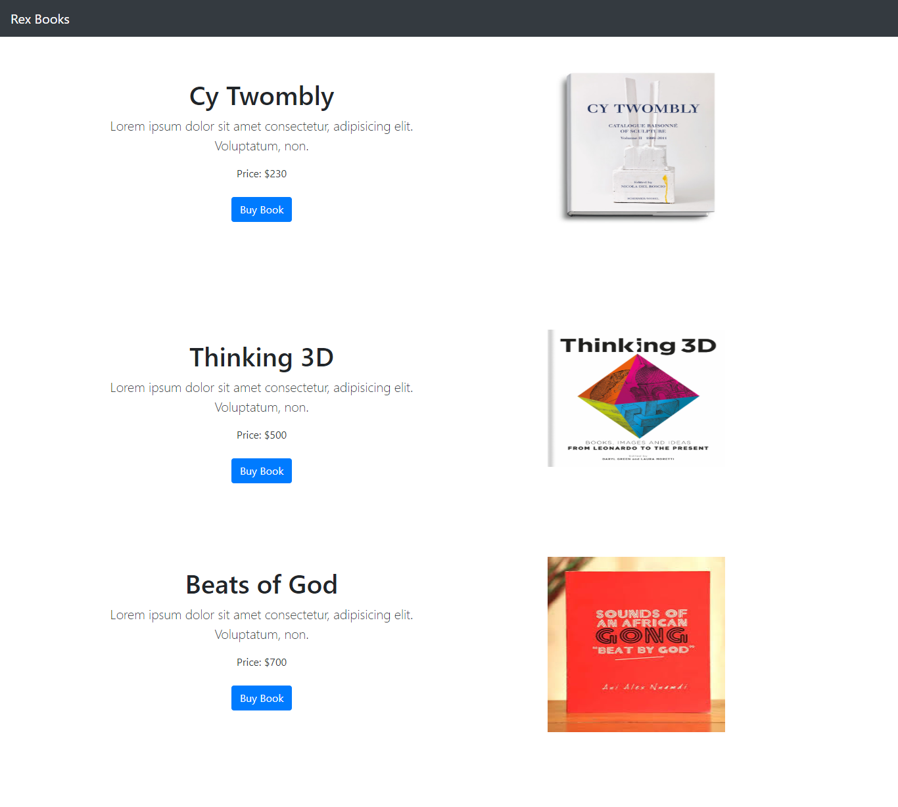
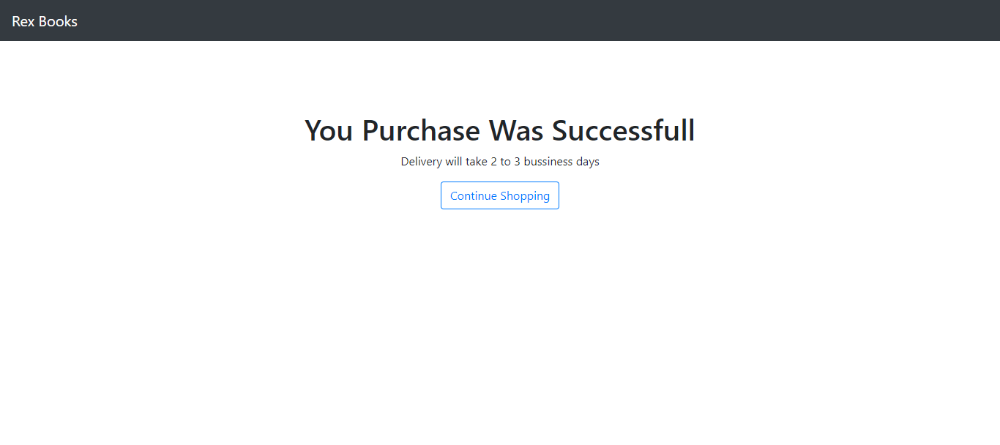

# Fullstack Nodejs/Vuejs App

this is an app that display list of books where user can purchase a book using stripe API. I developed this app while learning how to integrate payment to Nodejs app. You can check the app live [Here](https://book-sales-app.herokuapp.com/)





## Usage

Update the values/settings in .env file to your own.

## Install Dependencies

```
npm install
```

## Run App

```
# run in development
npm run dev

#run in production
npm start
```

- version: 1.0.0
- licence: MIT
